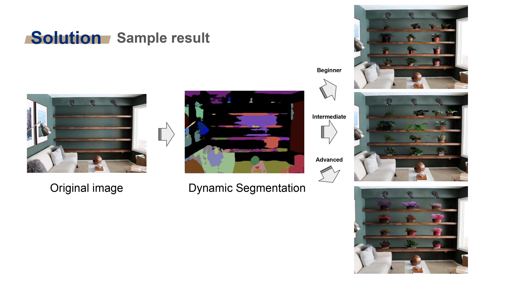

# DATATHON 2023 - TEAM : KAKAKHON
## 🪴PLANTUM🪴
___Your personalized AI plant curator using stable diffusion and segmentation models___

🥉 3rd Winner in Category: UN Sustainability Goal (organized by AWS Zürich)

[Slide](2023_Plantum_ETHDatathon.pdf)

Hyeongkyun Kim (UZH) - [LinkedIn](https://www.linkedin.com/in/hyeongkyun-kaden-kim/)

Songyi Han (UZH) - [LinkedIn](https://www.linkedin.com/in/songyi-han-720962167/)

Sanghwan Kim (ETH) - [LinkedIn](https://www.linkedin.com/in/sanghwan-kim-bb2a41193/?originalSubdomain=de)

 

 
## Folder Structure
- Used AWS Services
  - AWS Amplify : ./AWSamplify/index.html
  - AWS Gateway 
  - Lambda Function : ./AWSlambda/lambda_function.py
  - Amazon SageMaker
    - jumpstart-dft-stable-diffusion-2-inpainting : ./sg_endpoint_stdiffusion.py
    - jumpstart-dft-mx-semseg-fcn-resnet101-ade : ./sg_endpoint_semseg_res101.py

